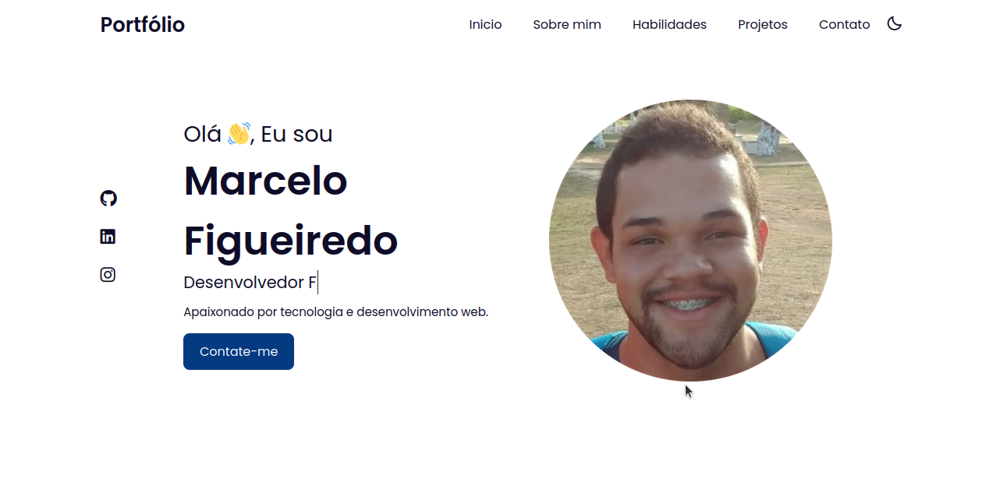

<h1 align="center"> Portfolio </h1>

  <a href="#-tecnologias">Tecnologias</a>&nbsp;&nbsp;&nbsp;|&nbsp;&nbsp;&nbsp;
  <a href="#-projeto">Projeto</a>&nbsp;&nbsp;&nbsp;|&nbsp;&nbsp;&nbsp;
  <a href="#memo-licença">Licença</a>

  

 

<h1>Desktop:</h1>
  
 
<h1>Mobile:</h1>
  

## 🚀 Tecnologias

Esse projeto foi desenvolvido com as seguintes tecnologias:

- HTML e CSS
- JavaScript
- ScrollReveal Js

## 💻 Projeto

O projeto teve como objetivo a construcao do meu portfolio pessoal algo que e bastante importante para um desenvolvedor. Nele pude colocar todo o
meu conhecimento das tecnologias as quais tenho conhecimento além de mostrar outros projetos que ja tenho construido durante o decorrer do meu aprendizado.

## :memo: Licença

Esse projeto está sob a licença MIT.

---
